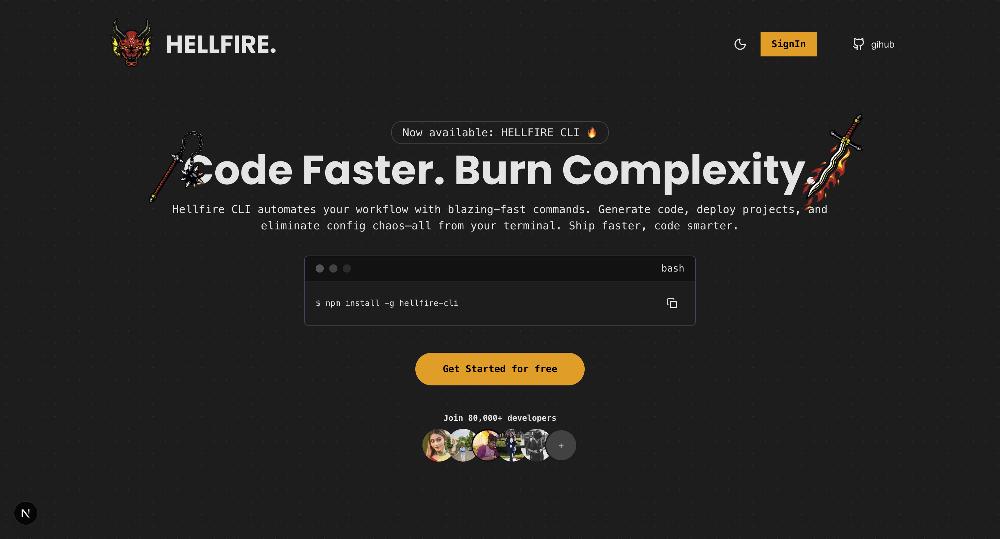
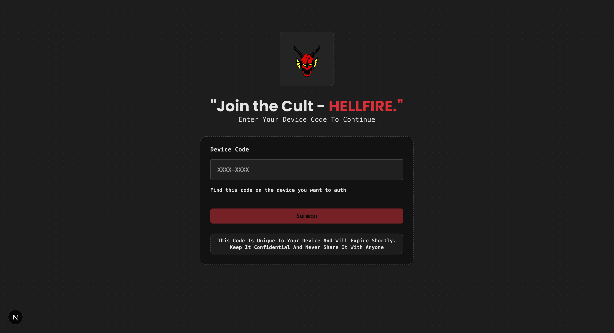
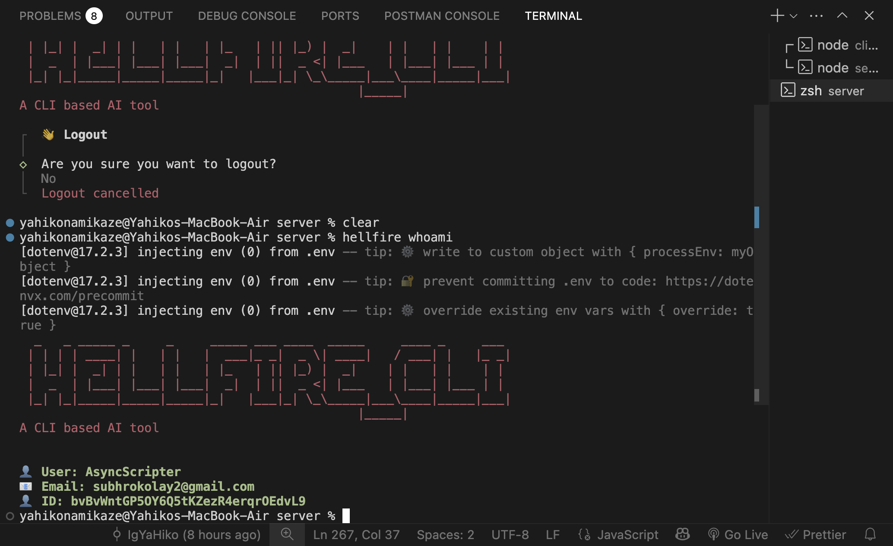

# 🔥 Hellfire_CLI

## 🖼️ UI Preview

### 🏠 Home Screen
A clean and modern landing interface for the Hellfire client.  


### 🔐 Device Authentication
The screen used for Better Auth's device-based login flow.  


### 💻 CLI Interface
Hellfire's command-line workflow for developers.  


---


Hellfire is a **CLI-based full-stack application** consisting of a **Next.js client** and an **Express server**.  
The project is currently in its initial development phase, and new features—such as **AI agentic tools**, **built-in code compiler**, and more—will be added soon.

This repository contains the complete codebase for both the frontend and backend under a single monorepo structure.

---

## 🚀 Current Features (More Coming Soon)

- Command Line Interface (CLI) based workflow  
- Full-stack architecture (Next.js client + Express server)  
- Organized monorepo structure  
- Easily extendable for future features  
- Placeholder for:
  - 🤖 AI agentic workflows  
  - 🧠 Terminal-based code compiler  
  - 🛠️ Developer tools & utilities  

---
```bash
# 📁 Project Structure

HELLFIRE/
│
├── client/ # Next.js frontend (UI, components, hooks)
├── server/ # Express backend (routes, controllers)
├── .gitignore
├── README.md
└── package.json # (optional) for root scripts if needed

## 📂 Inside Client (Next.js)

client/
│
├── app/ # Main Next.js app router
├── components/ # Reusable UI components
├── hooks/ # Custom React hooks
├── lib/ # Utilities, helpers
├── public/ # Static assets
├── node_modules/
├── .gitignore
├── package.json
├── next.config.ts
├── tsconfig.json
└── README.md (optional)

## 📂 Inside Server (Express)

server/
│
├── src/
│ ├── routes/ # Server routes
│ ├── controllers/ # Controllers / logic
│ ├── middlewares/ # Custom middleware
│ ├── config/ # Config files (DB, env)
│ └── index.ts # Entry point
│
├── node_modules/
├── .env
├── package.json
└── tsconfig.json
```
---

# 🛠️ Installation & Setup

### 1️⃣ Clone the Repository

```bash
git clone https://github.com/IgYaHiko/Hellfire.git
cd Hellfire

cd client
npm install
npm run dev

```
### The client will start on:
http://localhost:3000

### ▶️ Starting the Server (Express)
cd server
npm install
npm run dev

### The server will start on:
http://localhost:8080

### Then run:
npm run dev (client)
npm run dev (server)
